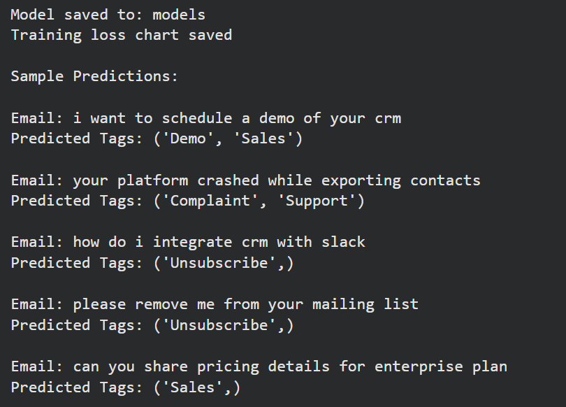
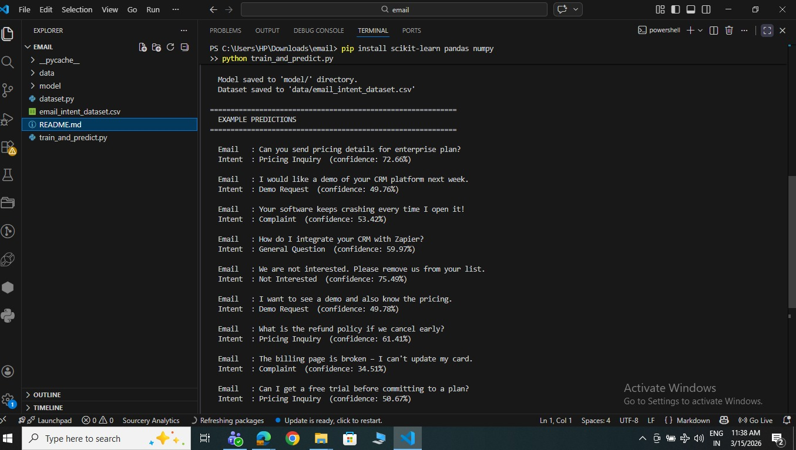
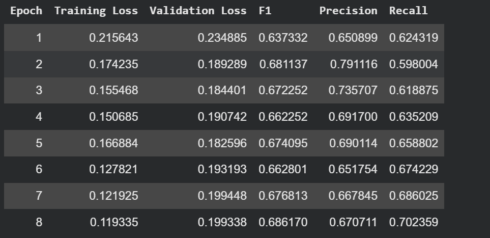

# ⚖️ AI Email Intelligence Module

An advanced **Natural Language Processing (NLP)** solution designed to automate email analysis within CRM ecosystems. By leveraging Transformer-based deep learning, this module classifies intent and assigns multi-label tags to streamline lead routing and customer support.

---

## 📌 Overview
Managing high volumes of incoming business emails is a bottleneck for many sales and support teams. This project implements a **BERT-based** intelligence layer that:

* **Email Intent Classification:** Determines the primary purpose (e.g., Demo Request vs. Complaint).
* **Automatic Topic Tagging:** Assigns one or more relevant tags to help categorize and route emails inside a CRM system.
* **Efficiency:** Replaces manual sorting with high-speed, deep-learning-based inference.

---

## 🚀 Key Features
* **Transformer Architecture:** Built using `bert-base-uncased` for superior context understanding.
* **Multi-Label Support:** Handles multiple tags per email (e.g., an email can be both *Sales* and *Pricing*).
* **Data Augmentation:** Includes synthetic dataset generation to improve model robustness.
* **Ready-to-Use Inference:** Provides a dedicated prediction function for easy integration.
* **Visualization:** Automated training loss and metrics tracking for model transparency.

---

## 🏗️ Methodology

### 1. Data Preparation
* **Preprocessing:** Email text is cleaned and tokenized using the BERT WordPiece tokenizer.
* **Multi-Label Encoding:** Labels are converted using `MultiLabelBinarizer` to support overlapping categories.
* **Split:** The dataset is divided into an 80/20 train/validation split.

### 2. Model Architecture
The system utilizes a BERT encoder with a custom linear classification head:
* **Activation:** Sigmoid (allows independent probability for each tag).
* **Loss Function:** `BCEWithLogitsLoss` (Binary Cross Entropy) to handle multi-label objectives.
* **Optimization:** Mixed precision training for faster GPU performance.

### 3. Training Configuration
| Parameter | Value |
| :--- | :--- |
| **Model** | bert-base-uncased |
| **Batch Size** | 8 |
| **Epochs** |  8|
| **Learning Rate** | $2 \times 10^{-5}$ |
| **Max Token Length** | 128 |
| **Metric** | F1 Score |

---

## 📊 Classification Categories

### Intent Categories
The system identifies the primary "Ask":
* `Pricing Inquiry`
* `Demo Request`
* `Complaint`
* `General Question`
* `Not Interested`

### CRM Topic Tags
Multiple tags can be assigned to a single email:
* **Support Tags:** `Complaint`, `Technical`, `Support`
* **Sales Tags:** `Demo`, `Pricing`, `Sales`
* **General Tags:** `Question`, `General`, `Unsubscribe`

---

## 📁 Project Structure
```text
email-intelligence-module/
│
├── dataset/
│   └── email_intent_dataset_fixed.csv   # Synthetic CRM dataset
│
├── models/                              # Saved artifacts
│   ├── config.json                      
│   ├── model.safetensors               
│   ├── tokenizer_config.json            
│   └── mlb.pkl                          # Label Encoder
│
├── train.py                             # Model training script
├── predict.py                           # Inference & Prediction script
├── requirements.txt                     # Dependencies
├── metrics.txt                          # Performance logs
└── README.md                            # Documentation

```

---

## 💻 Installation & Usage

### 1. Setup

```bash
# Clone the repository
git clone https://github.com/gaoharimran29-glitch/Business-Emails-Intent-Classifier
git lfs pull

# Install dependencies
pip install -r requirements.txt
```

### 2. Run Predictions

You can use the `test.py` script or import the function into your own Python code:


---

## 📈 Prediction Examples Tags Model



---

## 📈 Prediction Examples Intent Model



## Model Performance

